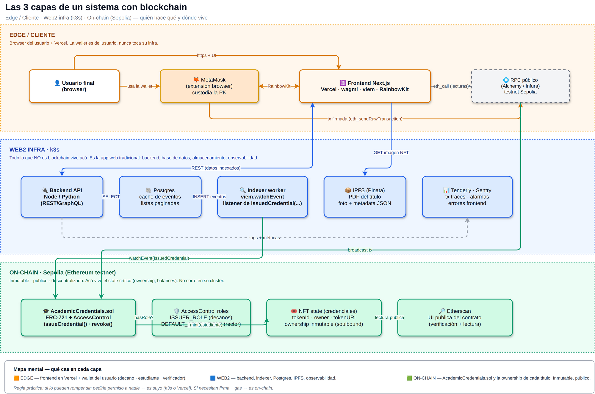
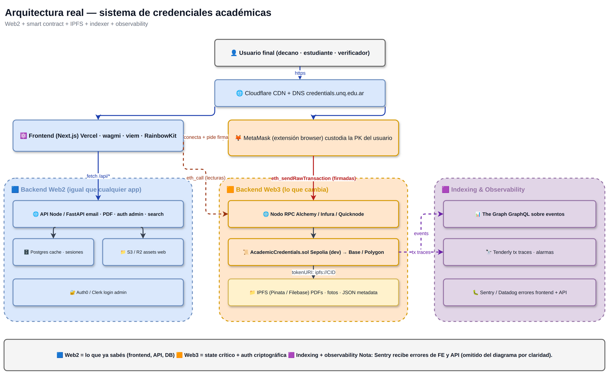

# Diagramas de arquitectura — del ciclo del contrato al sistema de credenciales

> **Para qué sirve esta página**: tener visualizaciones polidas que cubren todo el camino conceptual de la diplomatura — desde "qué es un smart contract" hasta "cómo se construye el sistema de credenciales académicas UNQ".

> **Cómo leer esta página**: arrancamos en lo más simple (el ciclo de un contrato), subimos al **mapa global de 3 capas** para tener el modelo mental, bajamos al **sistema real completo** con todas sus piezas, y cerramos con dos referencias tácticas para el día a día — cómo leer/escribir y qué es secreto vs público.

---

## 1 · El ciclo de un smart contract

Lo más fundamental: del archivo `.sol` que escribís en tu disco, al contrato deployado en la chain, al usuario final que lo usa desde el browser. Tres swim-lanes (tu máquina, blockchain, Etherscan) muestran qué pieza vive dónde y qué herramienta hace de bisagra entre ellas.

---

## 2 · Las 3 capas — mapa global del sistema

El modelo mental más alto: **edge / cliente** (browser del decano/estudiante/verificador + frontend en Vercel + MetaMask) · **web2 infra** (backend, indexer, Postgres, IPFS, observabilidad — la app web tradicional) · **on-chain** (`AcademicCredentials.sol` + roles + state inmutable de las credenciales en Sepolia).

> **Regla práctica**: si lo pueden romper sin pedirle permiso a nadie → es suyo (web2). Si necesitan firma + gas → es on-chain.

> **Cómo leer este diagrama**: lo de arriba (naranja) es lo que ve y toca el usuario. Lo del medio (azul) es la app web "de toda la vida" — un Next.js, un FastAPI, un Postgres. Lo de abajo (verde) es el contrato — la única pieza que **no controlan** una vez deployada.

---

## 3 · Arquitectura real del sistema de credenciales

Ahora bajemos al detalle. **El sistema completo**: Frontend (Vercel) + Backend Web2 (k3s) + `AcademicCredentials.sol` (Sepolia → más adelante Base/Polygon) + IPFS para PDFs y fotos + indexer The Graph + observabilidad (Tenderly + Sentry).

> **Para el TP final no necesitan TODOS estos componentes** — esto es la referencia de cómo se ve un sistema de credenciales en producción. Lo mínimo son: frontend + contrato + IPFS para el PDF. The Graph, Auth0, Cloudflare CDN, Sentry y Tenderly son enchufables después.

> **El contrato es UNA pieza** del sistema, no es todo. Es el "servicio de credenciales" en una app tradicional. El resto (UI, API, BD, login admin, monitoreo) sigue siendo lo de siempre.

---

## 4 · Read vs Write — la distinción crítica

La confusión #1 de todo principiante. `cast call` y `cast send` se ven idénticos en el código pero hacen cosas radicalmente distintas. **Regla mnemotécnica**: si la función Solidity dice `view` o `pure` → `cast call`. Cualquier otra cosa → `cast send`.

---

## 5 · Qué vive dónde — público vs privado

Mapa mental para saber qué se puede compartir y qué nunca. Todo lo que está del lado rojo (private key, frase BIP-39, `.env`) es secreto. Todo lo del lado verde (address, txs, bytecode, storage, source verificado) es **público por diseño** — cualquiera lo lee.

---

## Material relacionado

- [Clase 3 — Cierre de Clase 2 + Credenciales académicas](clase-3-clase.html) — la clase donde se introducen estos conceptos
- [Clase 4 — Frontend NFT + Seguridad](clase-4-clase.html)
- [Trabajo Final — Verificación de credenciales académicas UNQ](tp-final.html) — el TP de la diplomatura
